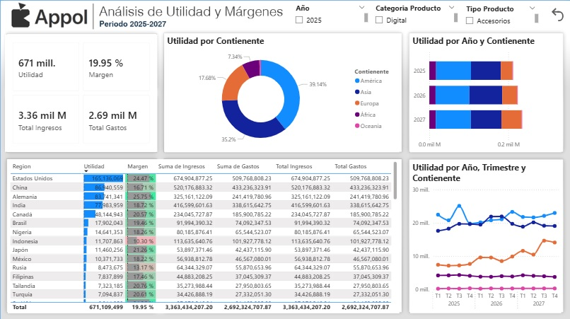

# 📊 Portafolio – Ulises Rodríguez

Ingeniero orientado a datos con enfoque en **resolver problemas reales de negocio**
mediante análisis, automatización y visualización ejecutiva.

Trabajo con datos incompletos, desordenados y de múltiples fuentes para convertirlos en información clara y accionable para la toma de decisiones.

## Perfil profesional

- Experiencia en análisis de datos aplicado a contextos reales (ventas, operaciones, clasificación)
- Enfoque en **proceso, impacto y escalabilidad**, no solo visualización
- Integración de Python, ML y Power BI para soluciones completas

## Stack técnico

- **Power BI**: modelado estrella, DAX, KPIs ejecutivos, storytelling
- **Python**: Jupyter, pandas, limpieza de datos, clasificación, RAG
- **SQL**: consultas, agregaciones, preparación de datos
- **Git / GitHub**: control de versiones y portafolio profesional

## Qué hago
Transformo datos reales y desordenados en información clara para la toma de decisiones.

## Proyectos destacados

### Inteligencia de ventas para restaurantes  
**Power BI + Python**

- Sistema de análisis que permite visualizar ventas, productos clave y rendimiento diario.
- Los datos son limpiados y normalizados en Python antes de ser consumidos por Power BI.

➡️ Resultado: reducción del tiempo de análisis y mejora en la toma de decisiones operativas.

### Clasificador automático de negocios (Retrieval-Augmented Knowledge Structuring Engine) 
**Python + RAG + reglas**

Sistema que clasifica automáticamente negocios según su descripción y productos,
combinando reglas, embeddings y retroalimentación persistente.

➡️ Resultado: categorización consistente y escalable sin intervención manual.

### Dashboard ejecutivo de KPIs financieros  
**Power BI**

Dashboard enfocado en métricas clave para seguimiento ejecutivo,
priorizando claridad, jerarquía visual y toma de decisiones rápidas.

## Foto de mis Dashboards

## 📌 Nota
Los dashboards mostrados forman parte de proyectos demostrativos.
Los datos han sido anonimizados o simulados con fines de portafolio.

